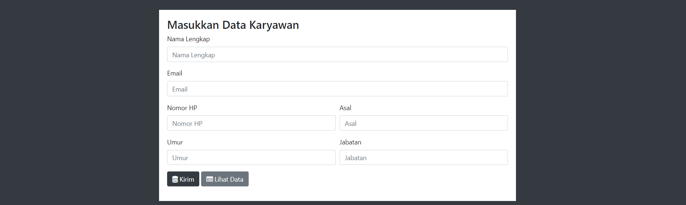
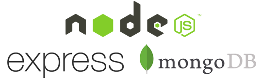

# Simple Mongo-Node-Express CRUD Apps


A simple application that created using MongoDB, Node.JS and Express.JS.


## Instructions

For the *back-end* dependencies
```bash
npm install
```

Run the *main server*. And it listens on port 3000.
```bash
npm start
```
For the *front-end* on the browser. Go to the Browser URL.
```bash
http://localhost:3000/employee
```


# paw-kelompok-20
Tugas PAW CRUD Kelompok 20

  **Anggota :**

- Afrizal Fayiz Pradanta     19/446765/TK/49870
- Alfina Syaharani           19/446766/TK/49871
- Hervi Nur Rahmandien       20/463601/TK/51593
- Ruth Grace Stevani         17/410485/TK/45842
- Sagara Aldavy M.N.S.       19/444070/TK/49266
